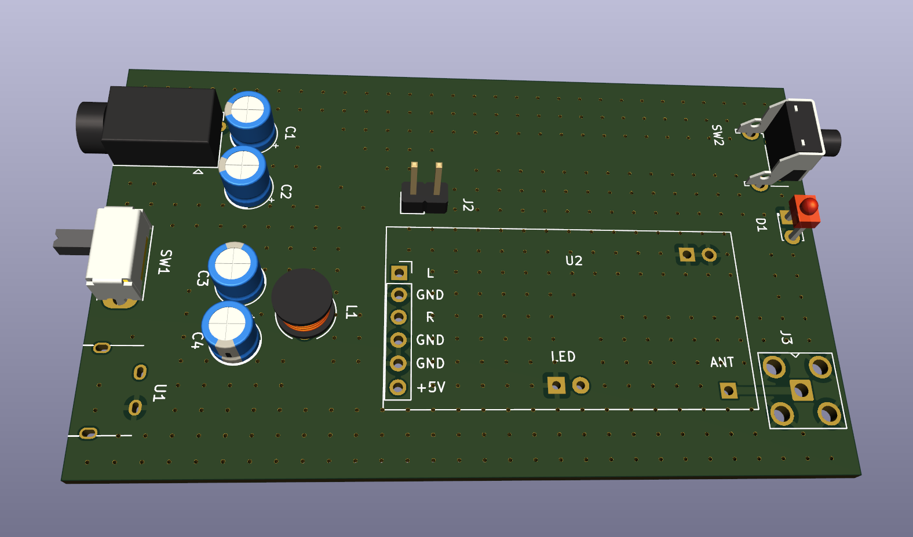

# XL-01M-Carrier
This repository includes the KiCAD project for a carrier board for the XL-01M-T and XL-01M-R 2.4GHz audio transmitter.
It is still a work in progress. First PCBs are ordered, but not testet yet.

# Picture of the XL-01M-T and XL-01M-R Modules

# Dokuments
| Dokument                                                   |Descripton                |
| -----------------------------------------------------------|--------------------------|
| [found docu](/documents/24GNRF24L01XL01MV1.80132905.pdf)   |Found Doku                |
| [audio connector](/documents/audio_3.5mm.png)              |3.5mm audio connector used|

